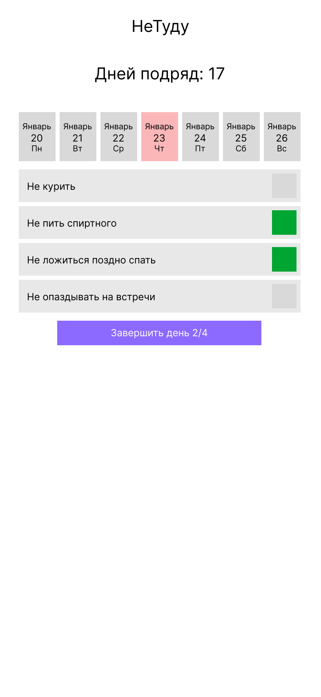

# Проект "НеТуду" (NotTodo)

"НеТуду" — это платформа, которая помогает пользователям отказаться от вредных привычек, превращая ежедневное отслеживание несделанных вредных действий в игру. Вместо списка дел, вы отмечаете то, что **не сделали**: "Не курил", "Не пил алкоголь", "Не ложился поздно спать", "Не опаздывал". За каждый день, когда все отмеченные вредные привычки были успешно избеганы, вы получаете +1 день в серии (стрик).

## Визуальная схема фронтенда

## Документация

1. Маркетинг и аналитика
    1. [Целевая аудитория](docs/01-business/01-target-audience.md)
    2. [Заинтересанты](docs/01-business/02-stakeholders.md)
    3. [Пользовательские истории](docs/01-business/03-requirements.md)
2. Аналитика:
    1. [Функциональные требования](docs/02-analysis/01-functional.md)
    2. [Нефункциональные требования](docs/02-analysis/02-nonfunctional.md)
3. DevOps
4. Архитектура
    1. [ADR](docs/03-architecture/01-adrs.md)
    2. [Описание API](docs/03-architecture/02-api.md)
    3. [Компонентная схема](docs/03-architecture/03-arch.md)
6. Тесты